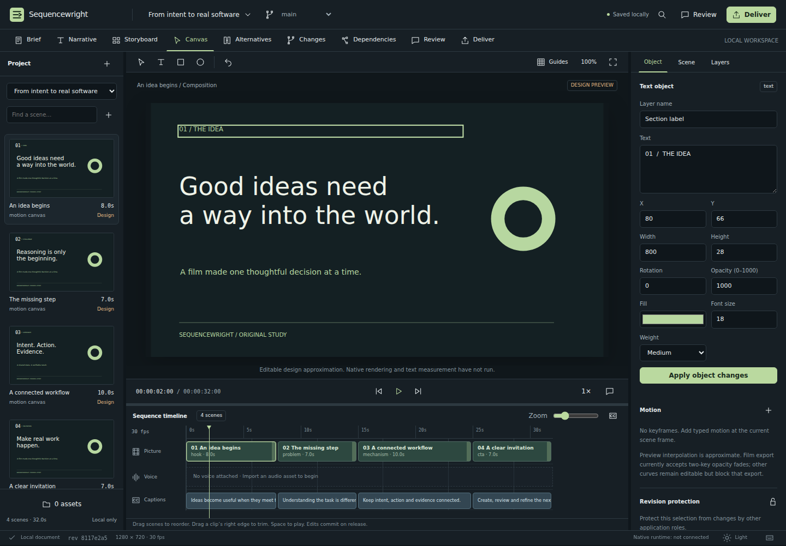

# Sequencewright

**Local-first audiovisual authoring for Semwright. Development alpha — not a finished production release.**

Sequencewright combines an editable scene canvas, frame-based timeline, narrative brief, scoped alternatives, branch review and immutable revision history. The browser UI and a real Semwright Native SDK driver use the **same application-owned SQLite state**. The application does not implement a second Broker, renderer, Graph or workflow authority.



The screenshot above is the running editor at source `93b4e40ead683e378f22131b7b045229fb48da17`, captured by the browser acceptance workflow. The canvas is a **design approximation**, not native-rendered media. [Light workspace](docs/assets/desktop-light.png) · [Mobile viewport](docs/assets/mobile.png).

## Run the local editor

Use **Node 24.21.x** for the verified runtime profile. The editor has no production npm dependencies and does not need a frontend build.

```sh
git clone https://github.com/seradotcom/sequencewright.git
cd sequencewright
npm start
```

Open `http://127.0.0.1:4318`. Data is stored in `.data/sequencewright.db`. The first launch creates three original, synthetic studies: a product sequence, an educational story and a brand study. The files and dialogue from the private specification kit are not included.

To select another application-owned data directory or local port:

```sh
SEQUENCEWRIGHT_DATA=/absolute/private/sequencewright-data PORT=4318 npm start
```

Keep the service on loopback. This alpha is not an authenticated multi-user web service. Stop it normally before making a filesystem backup; alternatively export a project archive from Deliver. Do not delete the database to solve an application error.

## What is implemented

| Area | Current implementation |
| --- | --- |
| Authoring | Editable text and shape objects, layer/scene inspectors, drag positioning, frame scrubbing, scene ordering and duration edits, typed keyframes, guides, dark/light themes and responsive layouts. |
| Editorial work | Brief and narration text, manual scoped text alternatives with A/B previews, deferred acceptance/rejection, anchored comments and explicit claim-review metadata. |
| Persistence | Application-owned SQLite transactions, revision/generation comparison, durable exact-request deduplication/recovery, immutable history, explicit branch comparison and three-way merge decisions. |
| Native SDK | Actual Rust `NativeDriver`, official TypeScript application binding and sandboxed `NodeBridge`; 37 application operation contracts plus the SDK observation/recovery surface. |
| Interchange | Project JSON archives, typed canonical Film JSON and SRT/WebVTT captions. Local binary image/audio/video import up to 16 MiB per asset with application revision binding, provenance, declared licensing and server-computed content digests. |
| Native production | Explicit owner/operator CLI: canonical Motion Canvas planning/render/measurement → digest-bound MLT FFV1 mezzanine. One exact-duration 48 kHz stereo PCM WAV can additionally be bound into MLT H.264/AAC delivery with decoded-final-audio verification. |
| Project Graph | The operator route can register immutable source/render/delivery evidence references in Semwright's canonical Project Graph and declare bounded `realizes` / `derived_from` relationships. These declarations remain explicitly **not execution-certified**; Sequencewright does not mint trusted Graph receipts. |
| Effect Conformance | The production operator invokes the pinned Native SDK `semwright-native-effects` helper to independently re-read immutable Film/render/delivery evidence and evaluate a bounded canonical artifact-property contract. Reports are `read_only` and explicitly carry `execution_authority=false`. |
| Verification | Real browser behavior, three canonical Film compilations and actual UI ↔ Broker/Driver Host ↔ Native SDK shared-state integration in GitHub Actions. |

The interactive **Deliver** workspace does not start native jobs yet. A narrow, explicit operator path can create a verified MP4 without turning the editor service into a renderer or scheduler. Voice recording/alignment, multitrack audio editing/mixing, Blender/Manim contributions, trusted execution-receipt admission into Project Graph, exhaustive Effect Conformance for native geometry/visibility/audio loudness/cue alignment, provider-backed AI, remote collaboration, Platform workflows and signed desktop installers are not completed. Delivery profiles currently express intent; they do not silently reflow a finished native render. See [STATUS.md](STATUS.md) for the exact boundaries.

## Actual Semwright integration

The dependency is pinned to public Semwright revision:

```text
4d291de26724810017ce7b6d185326514cb79fa6
Semwright 0.9.0-dev.1
```

The TypeScript source in `vendor/semwright-native-sdk/index.ts` is preserved with its upstream licenses and fingerprint in `SOURCE_LOCK.json`. The Rust dependencies use that same exact revision and a committed Cargo lockfile. The app owns state and transactions; the canonical Host owns native references, policy, isolation and tools.

The separate `sequencewright-compile` binary invokes **`semwright_motion_authoring::realize`**, not a reimplemented temporal solver. Its result is canonical timing/realization data and, by itself, explicitly reports that pixels/audio have not been rendered or measured. Production is a separate canonical Host route. Because the browser design font profile differs from the Motion Canvas runtime, `scripts/native-render.mjs` applies an explicit pinned production typography profile, records the substitution in its receipt and requires creative review rather than silently mutating the project.

Heavy compilation and native rendering are intentionally handled by GitHub Actions. A Native SDK workflow artifact contains the built driver, compiler, binding metadata and matching `sequencewright.cjs` bundle. Do not mix a binary and bundle from different runs: the bundle digest is compiled into the driver. The process bridge retains its tested 48 KiB JavaScript bundle ceiling; local binary media ingestion is deliberately kept outside that bridge instead of raising the Native SDK transport budget.

For a reviewed, owner-provisioned Linux host setup, see [native integration](docs/NATIVE_INTEGRATION.md). `scripts/provision-native.py` creates a new private owner configuration from explicit inputs; it does not start a daemon, modify operating-system sandbox policy, install anything globally or connect rendering runtimes.

## Tests and evidence

```sh
npm run check
npm test
```

These are the light application checks. Browser installation, native compilation and Host/runtime integration belong on the disposable CI runner:

| Workflow | Scope |
| --- | --- |
| `Studio behavior and visual evidence` | Application tests, nine browser acceptance cases and desktop/light/mobile screenshots. |
| `Native SDK and canonical compiler` | Exact-SHA binding build, real SDK contract registration and three Film compiler fixtures. |
| `Real UI and Native SDK Host` | Real canonical daemon, CLI, Driver Host, sandbox helper, application driver, shared HTTP state, durable historical recovery and daemon restart. |
| `Source package` | Deterministic source ZIP with a per-file digest manifest; no private data, caches, binaries or font files. |

Evidence is bound to the SHA on each run, not inherited from a previous green commit. [VERIFY.md](VERIFY.md) records the historical verified checkpoints and the boundaries they do not prove.

## Development boundaries

The application is deliberately not a screen-click automation wrapper. It also does not treat its own metadata as canonical Graph/Effects evidence: Project Graph re-reads owner-granted files through canonical routes, while Effect Conformance independently snapshots the immutable evidence files with the Native SDK helper. Preview interpolation and editorial advice remain distinguishable from native measurement. Unsupported Film curves, missing assets and missing native services are explicit errors/statuses rather than silently discarded work.

`src/production.mjs` is the bounded canonical connection used by the explicit `scripts/native-render.mjs` operator path. It is intentionally **not imported by the HTTP server** and is not an end-user rendering API. The connection requires an owner-selected canonical CLI digest, socket/session and output root; provenance from every Motion Canvas/MLT call is checked before it is admitted to the receipt. Interactive job control remains unfinished as described in [STATUS.md](STATUS.md).

Project-scoped Impeccable design guidance is installed in the development workspace, with its source recorded in `SOURCE_LOCK.json`; no global agent configuration is changed. [Design decisions and references](docs/DESIGN.md).

## License

Application source: **AGPL-3.0-only**, in [LICENSE](LICENSE). Vendored Semwright SDK code retains its upstream MIT/Apache-2.0 licenses; see [THIRD_PARTY_NOTICES.md](THIRD_PARTY_NOTICES.md). No third-party font binaries or private specification materials are distributed in this source package.
